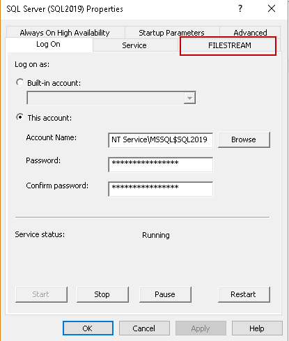

FileStreams
===========

This project exemplifies the use of SQL Server Filestream alignside Entity Framework Core.

This project:
- Does not generates any migration, the database shoul be created MANUALLY.
- Makes the assumption you have already configured Sql Server to use `FILESTREAM`.
- Makes the assumption the database and the project are in the same host.
- Makes the assumption no firewall is blocking communication between the project, sql server and the files location.

## Content
- [Content](#content)
- [Before using FILESTREAM](#before-using-filestream)
- [Usage](#usage)
- [References](#references)

## Before using FILESTREAM

- We can use the SELECT, INSERT, UPDATE, and DELETE statements similar to a standard database query in FILESTREAM
- We should use FILESTREAM if the object size is larger than 1 MB on average
- Each row should have a unique row ID to use this functionality, and it should not contain NULL values
- We can create the FILESTREAM filegroup on the compressed volume as well
- In the Failover clustering, we need to use a shared disk for the FILESTREAM filegroup
- We can add multiple data containers in the FILESTREAM filegroup
- We cannot encrypt FILESTREAM data
- You cannot use SQL logins with the FILESTREAM container
- When using connection strings, they must always have Integrated Security, as this is a requirement to use FILESTREAM. 

Example of a connection string:

```csharp
"data source=.;initial catalog=Filestream;User ID=sa;Password='1234';MultipleActiveResultSets=true;Integrated Security = true"
```

## Usage

### SQL Server configuration

The first thing to do is to configure **Sql Server**.  We can enable the FILESTREAM feature differently in SQL Server.

**Option 1.** During Installation: You can configure FILESTREAM during the SQL Server installation. However, I do not recommend doing it during the installation because we can later enable it as per our requirements

**Option 2.** SQL Server Configuration Manager: In the SQL Server Configuration Manager (**start -> Programs -> SQL Server Configuration Manager**), go to SQL Server properties In the SQL Server properties, you can see a tab `FILESTREAM`.

<p align="center">
  
</p>

Any of those configurations requires to follow the next steps:

1. Click on `FILESTREAM`, and you get below screen. Here you can see that this feature is not enabled by default.

<p align="center">
  
</p>

2. Put a tick in the checkbox `Enable FILESTREAM for Transact-SQL access`.

3. We can also enable the read\write access from the windows for file I/O access. Put a tick on the `Enable FILESTREAM for file I/O access` as well.

4. Specify the Windows share name and allow remote client access for this FILESTREAM data.

<p align="center">
  
</p>

5. Click Apply to activate the FILESTREAM feature in SQL Server. You will get a prompt to restart the SQL Server service. Once we have enabled FILESTREAM access and restarted SQL Server, we also need to specify the access level using SSMS. We need to make changes in sp_configure to apply this setting. 

6.  We need to specify the value from 0 to 2 while enabling SQL Server FILESTREAM using the following query. 

```sql
EXEC sp_configure filestream_access_level, 2
GO
RECONFIGURE WITH OVERRIDE
GO
```

The meaning for the value 2 is as follow:

| FILESTEAM access level 	| Description                                                                    	|
|------------------------	|--------------------------------------------------------------------------------	|
| 0                      	| Value 0 shows that FILESTREAM access is disabled for this                      	|
| 1                      	| Value 1 enables the FILESTREAM access for the SQL query.                       	|
| 2                      	| Value 2 enables the FILESTREAM access for the SQL query and Windows streaming. 	|

 If you do not enable FILESTREAM using the SQL Server Configuration Manager, You can get the error message

> FILESTREAM feature could not be initialized. The operating system Administrator must enable FILESTREAM on the instance using Configuration Manager.

### Database and project configuration

1. Create your database first

```sql
CREATE DATABASE [Filestream];
GO
```

2. Add a `FILESTREAM` group and pin to the folder creating a test file.

```sql
ALTER DATABASE [Filestream]
ADD FILEGROUP fsGroup CONTAINS FILESTREAM;
GO

ALTER DATABASE [Filestream]
ADD FILE ( NAME = 'fsFilestreamTest', FILENAME = 'c:\data\' )
TO FILEGROUP fsGroup;
GO
```

3. Create your table

```sql
CREATE TABLE [File]
(
  [Id]          INT                 IDENTITY(1,1) PRIMARY KEY,
  [Title]       VARCHAR(MAX)        NOT NULL,
  [Description] VARCHAR(MAX)        NULL,
  [Data]        VARBINARY(MAX)      FILESTREAM NULL,
  [MimeType]    VARCHAR(MAX)        NOT NULL,
  [FileId]      [uniqueidentifier]  ROWGUIDCOL NOT NULL UNIQUE,
)
GO
```

4. Now you are ready to run your project.

## References

- [FILESTREAM in SQL Server](https://www.sqlshack.com/filestream-in-sql-server/).
- [Enable and configure FILESTREAM](https://docs.microsoft.com/en-us/sql/relational-databases/blob/enable-and-configure-filestream?view=sql-server-ver15)
- [FILESTREAM (SQL Server)](https://docs.microsoft.com/en-us/sql/relational-databases/blob/filestream-sql-server?view=sql-server-ver15)